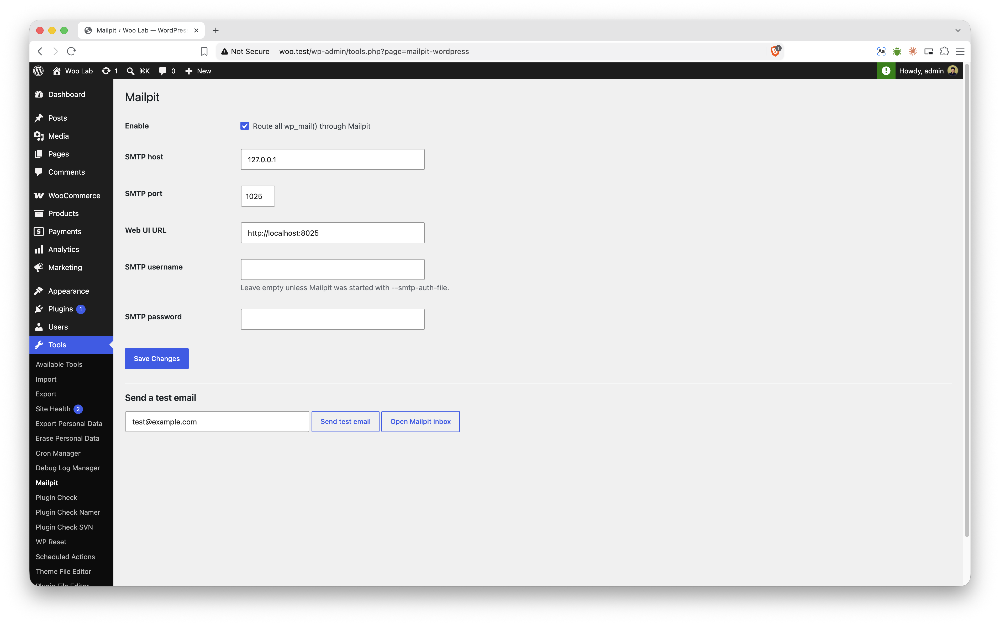

# Mailpit for WordPress

[](LICENSE)


Routes all outgoing WordPress mail (`wp_mail()`) through a local [Mailpit](https://mailpit.axllent.org/) SMTP server, so you can inspect emails during development without sending anything to real inboxes. Works with any plugin that uses `wp_mail()`, including WooCommerce.

> [!WARNING]
> **Development use only.** Don't activate this plugin on a production site. Real emails would be captured by Mailpit instead of being delivered.



## Requirements

- WordPress 5.9+
- PHP 7.4+
- Mailpit running locally (default SMTP port `1025`, web UI port `8025`). Tested with Mailpit v1.30.

## Installation

### 1. Run Mailpit

Pick one (see the [Mailpit install docs](https://mailpit.axllent.org/docs/install/) for more options):

```sh
# macOS (Homebrew)
brew install mailpit
brew services start mailpit        # or just run: mailpit

# Linux
sudo sh < <(curl -sL https://raw.githubusercontent.com/axllent/mailpit/develop/install.sh)
mailpit

# Docker (any OS)
docker run -d --name mailpit -p 8025:8025 -p 1025:1025 axllent/mailpit
```

Windows users can download a binary from the [Mailpit releases page](https://github.com/axllent/mailpit/releases) or use Docker.

### 2. Install the plugin

**With git:**

```sh
cd wp-content/plugins
git clone https://github.com/Ok9xNirab/mailpit-wordpress.git
wp plugin activate mailpit-wordpress
```

**From a ZIP:**

1. Download the repository as a ZIP (**Code → Download ZIP**).
2. In WordPress, go to **Plugins → Add New Plugin → Upload Plugin** and upload it.
3. Activate **Mailpit for WordPress**.

> [!NOTE]
> GitHub ZIPs extract to a folder named `mailpit-wordpress-main`. This works, but you can rename the folder to `mailpit-wordpress` if you want a cleaner slug.

### 3. Send a test email

```sh
wp mailpit test
```

Or use **Tools → Mailpit → Send test email**, then open http://localhost:8025.

## Configuration

The defaults match a standard local Mailpit install, so usually nothing needs to change.

### Admin UI

**Tools → Mailpit** lets you:

- Turn routing on or off
- Set the SMTP host, SMTP port and web UI URL
- Set an SMTP username and password (only needed if Mailpit runs with `--smtp-auth-file`)
- Send a test email and open the Mailpit inbox

### wp-config.php constants

Constants override saved settings, and the matching fields on the settings page are disabled:

```php
define( 'MAILPIT_HOST', '127.0.0.1' );
define( 'MAILPIT_SMTP_PORT', 1025 );
define( 'MAILPIT_UI_URL', 'http://localhost:8025' );
define( 'MAILPIT_USERNAME', '' );
define( 'MAILPIT_PASSWORD', '' );
```

| Setting   | Constant            | Default                 |
|-----------|---------------------|-------------------------|
| Host      | `MAILPIT_HOST`      | `127.0.0.1`             |
| SMTP port | `MAILPIT_SMTP_PORT` | `1025`                  |
| Web UI    | `MAILPIT_UI_URL`    | `http://localhost:8025` |
| Username  | `MAILPIT_USERNAME`  | *(empty — no auth)*     |
| Password  | `MAILPIT_PASSWORD`  | *(empty)*               |

## WP-CLI

```sh
wp mailpit test                      # send to the site admin email
wp mailpit test someone@example.com  # send to a specific address
```

## How it works

The plugin hooks `phpmailer_init` at the latest priority and switches PHPMailer to plain SMTP (no TLS) pointed at Mailpit. Send failures from `wp_mail_failed` are stored for an hour and shown on the settings page and in WP-CLI output.

## Troubleshooting

- **Test email fails / connection refused:** make sure Mailpit is running (`lsof -iTCP:1025 -sTCP:LISTEN`, or `docker ps` for Docker).
- **Mail still goes elsewhere:** another SMTP plugin (WP Mail SMTP, etc.) may override PHPMailer or replace `wp_mail()`. Deactivate it while using this plugin.
- **WordPress runs in Docker/Lando/DDEV:** `127.0.0.1` points at the WordPress container, not Mailpit. Set `MAILPIT_HOST` to the Mailpit service name (for example `mailpit`), or `host.docker.internal` if Mailpit runs on the host.

## Uninstall

Deleting the plugin from the admin removes its saved option (`mailpit_wp_settings`) and cached error transient.

## Contributing

Bug reports and pull requests are welcome. Please open an issue first for larger changes. Code follows the [WordPress Coding Standards](https://developer.wordpress.org/coding-standards/wordpress-coding-standards/php/).

## License

[GPL-2.0-or-later](LICENSE), the same license as WordPress.

## Author

[Istiaq Nirab](https://nirab.me)
